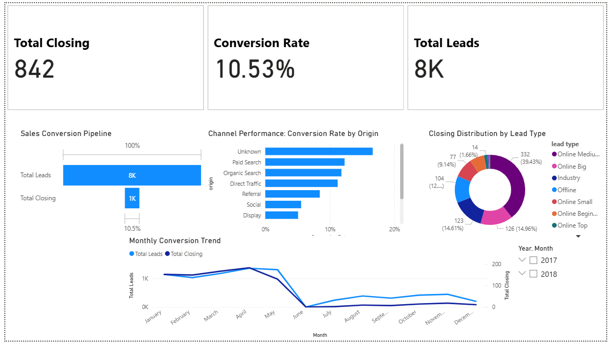

# 📊 Olist Marketing Funnel Analysis
**Analyzing Lead-to-Deal Conversion & Marketing Performance**

## 📝 Project Overview
Proyek ini bertujuan untuk menganalisis efisiensi *marketing funnel* dari dataset Olist. Fokus utamanya adalah memahami bagaimana performa konversi dari Leads (MQL) menjadi Closed Deals serta mengidentifikasi tren bulanan selama periode 2017-2018.

## 🛠️ Tech Stack
* **Python (Pandas):** Data Cleaning, Merging, & Pre-processing.
* **Power BI:** Data Modeling, DAX, & Interactive Dashboarding.

## 📁 Repository Structure
```text
📂 Data
 ├── 📂 raw          # Dataset asli (MQL & Closed Deals)
 └── 📂 cleaned      # Dataset hasil olahan Python (ready for BI)
📂 Notebook          # Jupyter Notebook / Python script (.py)
📂 Dashboard         # File Power BI (.pbix)
📂 Visualisasi       # Screenshot dashboard untuk dokumentasi
```

## 📈 Key Insights

   Conversion Rate (CR): Rata-rata konversi di tahun 2017 hanya mencapai 5%, konversi rate yang tinggi di angka 13.02% di setengah tahun 2018, membuat rata rata konversi di periode 2017 & 2018 mencapai angka 10.53%.

   Peak Season: Tahun 2018 menunjukkan volume leads dan konfersi tertinggi di setengah tahun pertamanya.
   
   Anomali: Terdapat penurunan trend secara drastis pada bulan Juni 2018 dan disusul stagnasi hingga Desember 2018.

## 💡 Business Recommendations

   Berdasarkan hasil analisis, berikut adalah beberapa strategi yang disarankan:

   Mengacu pada data terakhir tahun 2018, optimasi Leads di Bulan Maret - April: Karena volume leads memuncak di bulan 2 bulan itu, tim sales harus dipersiapkan dengan kapasitas ekstra agar respon tetap cepat dan Conversion Rate tidak turun seperti yang terjadi pada bulan may tahun 2018.

   Investigasi Anomali Leads dan Conversion Rate: Terjadi penurunan volume leads sejak Juni yang stagnan hingga Desember dan diikuti anjloknya conversion rate pada periode Juni-Desember. Perlu dilakukan audit pada kanal marketing di bulan Juni untuk mengidentifikasi penyebab turunnya performa secara drastis 

   Segmentasi Leads: Disarankan untuk memprioritaskan leads dari kanal yang memiliki historis konversi di atas rata-rata (13.02%) guna menekan biaya akuisisi (CAC).

   Retensi Seller: Mengingat hanya sekitar 13% leads yang menjadi seller, tim onboarding perlu menyederhanakan proses pendaftaran agar mengurangi hambatan (friction) bagi calon seller baru di tahun tahun berikutnya.

## 📊 Dashboard Preview


💡 Key Features (Power BI)

   Dynamic Measures: Perhitungan CR otomatis menggunakan DAX yang menangani data null secara akurat.

   Interactive Slicers: Filter berdasarkan bulan untuk melihat tren secara mendalam.

🚀 How to Run

   Data Cleaning: Jalankan file di folder  untuk melihat proses pembersihan data.

   Dashboard: Download file di folder  dan buka menggunakan Power BI Desktop.
